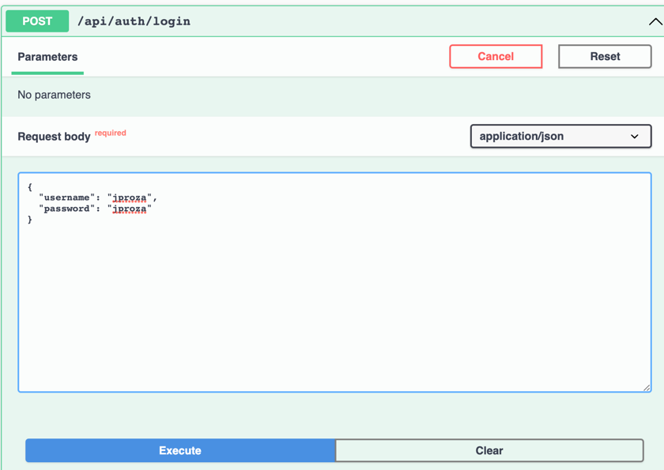

# API-Rest-Heroes
Spring Boot 2 - Java 11 - JWT - HATEOAS - H2 db - AspectJ - OpenAPI - CACHING 

# Documentación de la API
 1. http://localhost:8080/swagger-ui/index.html

# Como utilizar la API

1. Hacer login en la API auth : 
   1. POST -> http://localhost:8080/api/auth/login
   2. 
      {
      "username": "jproza",
      "password": "jproza"
      }
   
      * Caso contrario que no se haga login obtendrá el mensaje de error 401 (Unauthorized):
         {
         "path": "/api/heroes",
         "error": "Unauthorized",
         "message": "Full authentication is required to access this resource",
         "status": 401
         }
     
      
      *** jproza es un usuario por defecto dado de alta via el script de inicialización en data.sql ***

2. Consultar cualquier endpoint disponible de la API Heroes:
   1. GET -> http://localhost:8080/api/heroes
   2. GET -> http://localhost:8080/api/heroes?nombre=h
   3. GET -> http://localhost:8080/api/heroes/2
   4. POST-> http://localhost:8080/api/heroes
      1. body: {
         "nombre":"Hormiga Atomica"
         }
   5. PUT -> http://localhost:8080/api/heroes/2
      1. body: {
         "nombre":"Hulk2"
         }
   6. DELETE -> http://localhost:8080/api/heroes/2
   
3. Hacer Logout:
   1. POST -> http://localhost:8080/api/auth/logout

# JWT
El Token se guarda en una cookie de session no debe preocuparse por pasarlo en los headers.

# Postman
Tiene disponible las collections para ejecutar en resources/postman

# H2 en memoria

 jdbc:h2:mem:heroesdb en http://localhost:8080/h2-ui/

# Mantenimiento de la API

• Consultar todos los súper héroes.

• Consultar un único súper héroe por id.

• Consultar todos los súper héroes que contienen, en su nombre, el valor de un parámetro
enviado en la petición. Por ejemplo, si enviamos “man” devolverá “Spiderman”, “Superman”,
“Manolito el fuerte”, etc.

• Modificar un súper héroe.

• Eliminar un súper héroe.

• Test unitarios de algún servicio.

#Logs
heroes.log -> Información sobre tiempos de ejecución mediante annotation @LogHeroes
y eventos sucedidos.

#Caching

Un verbo/metodo cacheado en la API por ejemplo es el GET -> http://localhost:8080/api/heroes
(obtener todos los heroes) - ejecutar varias veces y notarás que los tiempos
de ejecución son menores cada vez.

#Seguridad
Se genera un JWT válido post login . En el logout se elimina. Almacenamiento vía cookie.
1. signWith(SignatureAlgorithm.HS512, jwtSecret)

#Tests

#Docker
FROM adoptopenjdk/openjdk11:alpine-jre

### Refer to Maven build -> finalName
ARG JAR_FILE=target/heroes-application-0.0.1-SNAPSHOT.jar

### cd /opt/app
WORKDIR /opt/app

### cp target/heroes-application-0.0.1-SNAPSHOT.jar /opt/app/app.jar
COPY ${JAR_FILE} app.jar

### java -jar /opt/app/app.jar
ENTRYPOINT ["java","-jar","app.jar"]

